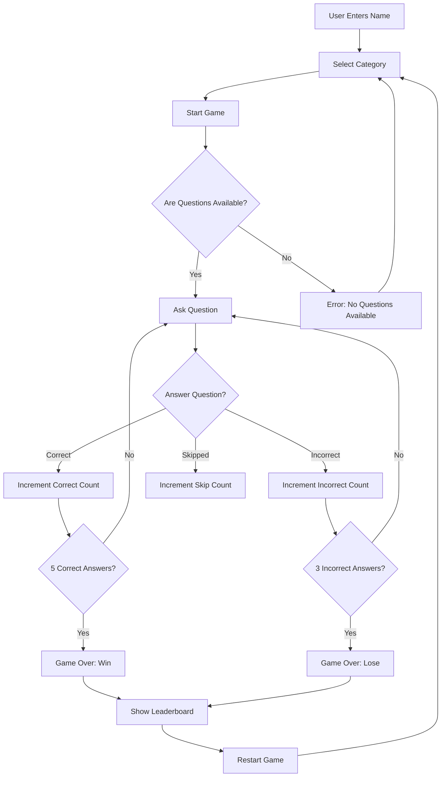

```mermaid
graph TD
    A[User Enters Name] --> B[Select Category]
    B --> C[Start Game]
    C --> D{Are Questions Available?}
    D -- Yes --> E[Ask Question]
    D -- No --> F[Error: No Questions Available]

    E --> G{Answer Question?}
    G -- Correct --> H[Increment Correct Count]
    G -- Incorrect --> I[Increment Incorrect Count]
    G -- Skipped --> J[Increment Skip Count]

    H --> K{5 Correct Answers?}
    I --> L{3 Incorrect Answers?}

    K -- Yes --> M[Game Over: Win]
    K -- No --> E

    L -- Yes --> N[Game Over: Lose]
    L -- No --> E

    M --> O[Show Leaderboard]
    N --> O[Show Leaderboard]

    F --> B
    O --> P[Restart Game]
    P --> B
```