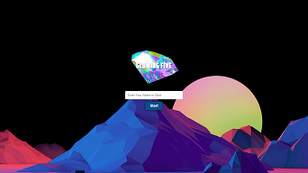
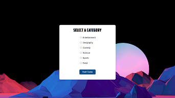
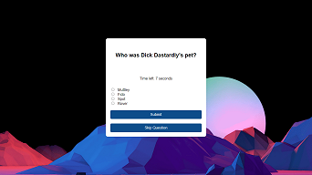
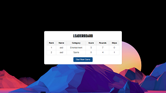

### Planning and Analysis Sheet

   
  

#### 1. **Project Overview**

| Item              | Description                                                                 |
|-------------------|-----------------------------------------------------------------------------|
| Project Name      | Flask Quiz Application                                                      |
| Purpose           | A web-based quiz game where users answer questions from different categories.|
| Main Features     | User registration, category selection, question management, score tracking, leaderboard display, and game management. |

---

#### 2. **Functionalities**

| **Functionality**         | **Description**                                                                                                 | **Status**      | **Priority** |
|---------------------------|----------------------------------------------------------------------------------------------------------------|-----------------|--------------|
| User Registration         | Users can enter their name before starting the game.                                                           | Completed       | High         |
| Category Selection        | Users can choose from a list of categories (e.g., Entertainment, Geography, Comedy) before the quiz starts.     | Completed       | High         |
| Question Loading          | Load questions from different CSV files based on the selected category.                                         | Completed       | High         |
| Non-Repeating Questions   | Ensure that questions are not repeated within a single game session.                                            | Completed       | High         |
| Dynamic Title Updates     | Update the HTML title to show the current round or "Game Over" when the game ends.                              | Completed       | Medium       |
| Score Tracking            | Track the user's score, round, and number of skips per game session.                                            | Completed       | High         |
| Leaderboard Display       | Display the leaderboard with user names, scores, and categories.                                                | Completed       | Medium       |
| Restart Game              | Allow users to restart the game after it ends.                                                                  | Completed       | High         |
| View Leaderboard          | Provide a button to view the leaderboard when the game is over.                                                 | Completed       | Medium       |
| Error Handling            | Gracefully handle errors (e.g., file reading issues, empty question lists).                                     | In Progress     | High         |
| Responsive Design         | Ensure the application is fully responsive and works well on different devices.                                 | In Progress     | Low          |

---

#### 3. **Testing Plan**

| **Test Case**                                  | **Description**                                                                                 | **Expected Outcome**                                                       | **Status**        |
|------------------------------------------------|-------------------------------------------------------------------------------------------------|---------------------------------------------------------------------------|-------------------|
| User Registration Test                         | Enter different names and start the game.                                                       | Game starts with the provided user name.                                   | Passed            |
| Category Selection Test                        | Select different categories (Entertainment, Geography, Comedy).                                  | Correct questions load based on the selected category.                     | Passed            |
| Question Loading and Encoding Test             | Ensure all questions are loaded correctly from various CSV files.                                | No `UnicodeDecodeError` or missing question issues.                        | Passed            |
| Non-Repeating Question Test                    | Ensure no question is repeated in a single game session.                                         | Questions are unique within each session.                                  | Passed            |
| Dynamic Title Update Test                      | Check if the title shows the correct round number or "Game Over."                                 | Title updates correctly as per the game state.                             | Passed            |
| Score Tracking and Game Over Test              | Complete the game to verify score, round count, and win/loss conditions.                         | Scores and results display correctly on game completion.                   | Passed            |
| View Leaderboard Test                          | Click "View Leaderboard" after the game ends.                                                    | Leaderboard displays correctly with updated scores.                        | Passed            |
| Restart Game Test                              | Click "Restart Game" after the game ends.                                                        | Game resets properly, and the user is prompted to enter their name again.   | Passed            |
| Error Handling Test                            | Force errors (e.g., missing file, invalid CSV format) and observe behavior.                      | Graceful error messages displayed, no app crash.                           | In Progress       |
| Responsive Design Test                         | Test on different devices (desktop, tablet, mobile) and screen sizes.                            | Application is fully responsive, no layout issues.                         | In Progress       |

---

#### 4. **Debugging Report**

| **Issue**                                         | **Cause**                                                | **Solution Implemented**                                                                                             | **Status**    |
|---------------------------------------------------|----------------------------------------------------------|-----------------------------------------------------------------------------------------------------------------------|---------------|
| UnicodeDecodeError: 'utf-8' codec can't decode... | CSV files have characters not encoded in `utf-8`.        | Modified `load_questions` function to try different encodings (`utf-8` and `latin-1`).                                | Resolved      |
| IndexError: list index out of range                | Malformed CSV data or empty lines.                       | Added validation to check the number of fields in each line before processing.                                         | Resolved      |
| IndexError: Cannot choose from an empty sequence   | No questions available due to all questions being asked. | Added logic to check if any questions remain before selecting one.                                                     | Resolved      |
| Repeating Questions                                | Questions were repeated within a single game session.    | Implemented a mechanism to track and exclude asked questions from being selected again.                                | Resolved      |
| Title Not Updating Correctly                       | Title did not reflect the current round or "Game Over".  | Dynamically set the title in `base.html` based on the game state passed from Flask.                                    | Resolved      |
| Error Handling for Invalid CSV Format              | Application crashed on encountering invalid CSV format.  | Added validation and error handling to log and skip malformed lines in CSV files.                                      | In Progress   |
| Layout Issues on Mobile Devices                    | Layout not fully responsive on smaller screens.          | Applied CSS media queries and tested with different devices to ensure responsiveness.                                  | In Progress   |
