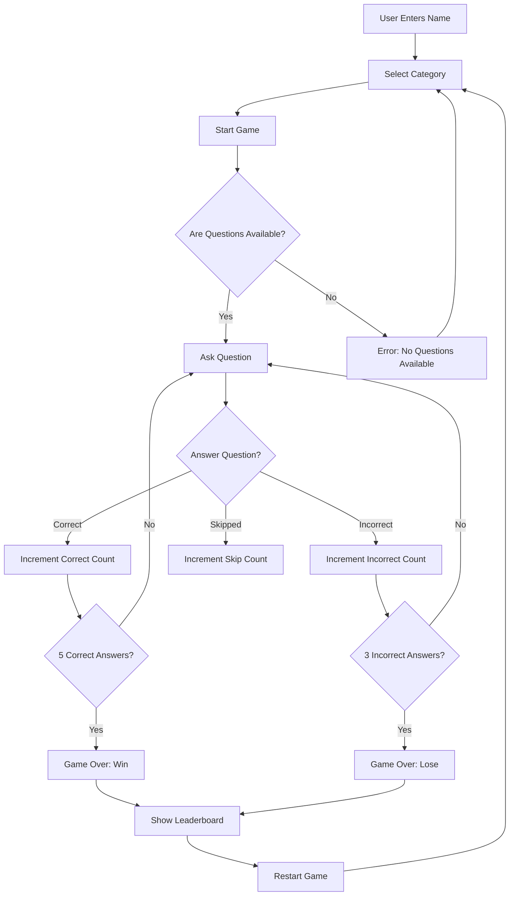

# Quiz Masters

This is a web-based quiz game built using Python and the Flask web framework. The game loads questions from a CSV file and presents them to the player one at a time. The player wins by correctly answering 5 questions before making 3 incorrect attempts.

## Deployment
You can access a live version of the application that is fully functional: [On Render](https://quizmasters.onrender.com)

Click the link to explore the quiz game and test it live!


## Table of Contents

1. [Functionalities](#functionalities)
2. [Features](#features)
3. [Installation](#installation)
4. [How to Play?](#how-to-play?)
5. [Flow Chart](#flow-chart)
6. [File Structure](#file-structure)
7. [Testing](#testing)
8. [Debugging](#debugging)
9. [Contributing](#contributing)
10. [License](#license)

## Funtionalities

| **Functionality**         | **Description**                                                                                                 | **Status**      | **Priority** |
|---------------------------|----------------------------------------------------------------------------------------------------------------|-----------------|--------------|
| User Registration         | Users can enter their name before starting the game.                                                           | Completed       | High         |
| Category Selection        | Users can choose from a list of categories (e.g., Entertainment, Geography, Comedy) before the quiz starts.     | Completed       | High         |
| Question Loading          | Load questions from different CSV files based on the selected category.                                         | Completed       | High         |
| Non-Repeating Questions   | Ensure that questions are not repeated within a single game session.                                            | Completed       | High         |
| Dynamic Title Updates     | Update the HTML title to show the current round or "Game Over" when the game ends.                              | Completed       | Medium       |
| Score Tracking            | Track the user's score, round, and number of skips per game session.                                            | Completed       | High         |
| Leaderboard Display       | Display the leaderboard with user names, scores, and categories.                                                | Completed       | Medium       |
| Restart Game              | Allow users to restart the game after it ends.                                                                  | Completed       | High         |
| View Leaderboard          | Provide a button to view the leaderboard when the game is over.                                                 | Completed       | Medium       |
| Error Handling            | Gracefully handle errors (e.g., file reading issues, empty question lists).                                     | In Progress     | High         |
| Responsive Design         | Ensure the application is fully responsive and works well on different devices.                                 | In Progress     | Low          |


## Features

- Multiple-choice questions loaded from a CSV file.
- Randomized question selection.
- Track of correct and incorrect answers.
- Win or lose the game based on player performance.
- Simple web interface with HTML forms.

## Installation

### Prerequisites

- Python 3.x installed on your system.
- Flask library for Python.

### Steps

1. Clone the repository:

   ```bash
   git clone https://github.com/alanmaizon/quizmasters.git
   cd quizmasters
   ```

2. Install required Python packages:

   ```bash
   pip install Flask
   ```

3. You can either create or modify the CSV files. The CSV file should follow this structure:

   ```
   Question;Option1;Option2;Option3;Option4;CorrectAnswerIndex
   ```

   Example:

   ```
   When did the Berlin Wall fall?;1989;1988;1987;1990;1
   ```

4. Run the Flask application:

   ```bash
   python app.py
   ```

5. Open a web browser and navigate to `http://127.0.0.1:5000/` to start playing the game.

## How to Play

- When you start the game, the first question will be displayed.
- Out of 4 options only 1 is correct, you can skip questions.
- The game will display whether your answer is correct or incorrect.
- The game continues until you either answer 5 questions correctly or get 3 incorrect answers.

## Flow Chart



## File Structure

```
glowing-five/
│
├── app.py                # Main Flask application, handles routes and game logic
├── models.py             # Models for game state, leaderboard, and utility functions like question loading
├── modules.py            # Functions to manage CSV file creation, editing, and manipulation
├── setup.py              # Setup script for configuring the application on Win32 systems
├── exceptions.py         # Custom exception classes for handling errors in game logic and user input
├── validators.py         # Validation functions for checking question formats and user input
├── static/
│   ├── css/              # Stylesheets for styling the app's frontend
│   ├── js/               # JavaScript files for handling frontend interactivity
│   ├── img/              # Directory for storing image assets, including the main logo
│   ├── csv/              # Directory containing quiz CSV files for different categories
├── templates/
│   └── base.html         # Base template for the overall layout and structure of the app
│   └── categories.html   # Template for selecting quiz categories
│   └── error.html        # Template for displaying error messages (e.g., no questions available)
│   └── input_name.html   # Template for inputting the user's name to start the game
│   └── leaderboard.html  # Template for displaying the leaderboard and scores
└── README.md             # This README file
```

## Testing

| **Test Case**                                  | **Description**                                                                                 | **Expected Outcome**                                                       | **Status**        |
|------------------------------------------------|-------------------------------------------------------------------------------------------------|---------------------------------------------------------------------------|-------------------|
| User Registration Test                         | Enter different names and start the game.                                                       | Game starts with the provided user name.                                   | Passed            |
| Category Selection Test                        | Select different categories (Entertainment, Geography, Comedy).                                  | Correct questions load based on the selected category.                     | Passed            |
| Question Loading and Encoding Test             | Ensure all questions are loaded correctly from various CSV files.                                | No `UnicodeDecodeError` or missing question issues.                        | Passed            |
| Non-Repeating Question Test                    | Ensure no question is repeated in a single game session.                                         | Questions are unique within each session.                                  | Passed            |
| Dynamic Title Update Test                      | Check if the title shows the correct round number or "Game Over."                                 | Title updates correctly as per the game state.                             | Passed            |
| Score Tracking and Game Over Test              | Complete the game to verify score, round count, and win/loss conditions.                         | Scores and results display correctly on game completion.                   | Passed            |
| View Leaderboard Test                          | Click "View Leaderboard" after the game ends.                                                    | Leaderboard displays correctly with updated scores.                        | Passed            |
| Restart Game Test                              | Click "Restart Game" after the game ends.                                                        | Game resets properly, and the user is prompted to enter their name again.   | Passed            |
| Error Handling Test                            | Force errors (e.g., missing file, invalid CSV format) and observe behavior.                      | Graceful error messages displayed, no app crash.                           | In Progress       |
| Responsive Design Test                         | Test on different devices (desktop, tablet, mobile) and screen sizes.                            | Application is fully responsive, no layout issues.                         | In Progress       |

---

Testing was conducted manually by running the Flask application and performing the following actions:

1. **Correct Answers:**
   - Ensured that the correct count increases when a correct option is selected.
   - Verified that the game ends with a win after 5 correct answers.

2. **Incorrect Answers:**
   - Confirmed that the incorrect count increases when an incorrect option is selected.
   - Checked that the game ends with a loss after 3 incorrect answers.

3. **Question Randomization:**
   - Observed that the questions are presented in a random order.

4. **Form Submission:**
   - Ensured that the correct and incorrect results are displayed immediately after submission.
   - Verified that the form resets for the next question.

## Debugging

| **Issue**                                         | **Cause**                                                | **Solution Implemented**                                                                                             | **Status**    |
|---------------------------------------------------|----------------------------------------------------------|-----------------------------------------------------------------------------------------------------------------------|---------------|
| UnicodeDecodeError: 'utf-8' codec can't decode... | CSV files have characters not encoded in `utf-8`.        | Modified `load_questions` function to try different encodings (`utf-8` and `latin-1`).                                | Resolved      |
| IndexError: list index out of range                | Malformed CSV data or empty lines.                       | Added validation to check the number of fields in each line before processing.                                         | Resolved      |
| IndexError: Cannot choose from an empty sequence   | No questions available due to all questions being asked. | Added logic to check if any questions remain before selecting one.                                                     | Resolved      |
| Repeating Questions                                | Questions were repeated within a single game session.    | Implemented a mechanism to track and exclude asked questions from being selected again.                                | Resolved      |
| Title Not Updating Correctly                       | Title did not reflect the current round or "Game Over".  | Dynamically set the title in `base.html` based on the game state passed from Flask.                                    | Resolved      |
| Error Handling for Invalid CSV Format              | Application crashed on encountering invalid CSV format.  | Added validation and error handling to log and skip malformed lines in CSV files.                                      | In Progress   |
| Layout Issues on Mobile Devices                    | Layout not fully responsive on smaller screens.          | Applied CSS media queries and tested with different devices to ensure responsiveness.                                  | In Progress   |

---

Several issues were identified and addressed during development:

1. **Incorrect display of questions and options** 
   - Ensured that the CSV file is read and parsed correctly, and that the HTML template receives the correct data structure.

2. **Game not resetting correctly after a win/loss** 
   - Added initialization of game state variables (`correct_count`, `incorrect_count`, `round`) in the `start_game` function.

3. **Form submission not correctly identifying the selected option.** 
   - Adjusted the HTML form to ensure that the selected option is passed correctly as a POST parameter.

4. **Incorrect game state tracking after form submission.** 
   - Verified the logic for updating the `correct_count` and `incorrect_count` to ensure the game progresses as expected.

## Contributing

Contributions are welcome! Please fork the repository and create a pull request with your changes. Ensure that your code follows the existing style and that you have tested your changes.

## License

This project is licensed under the MIT License. See the [LICENSE](LICENSE) file for more details.

---

### Module 3 - Python - UCD Professional Academy - Alan Maizon
